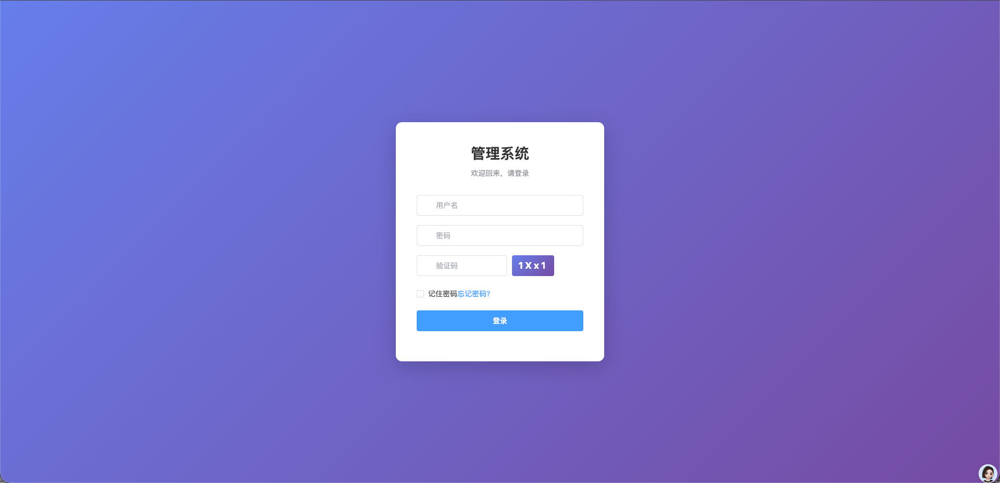
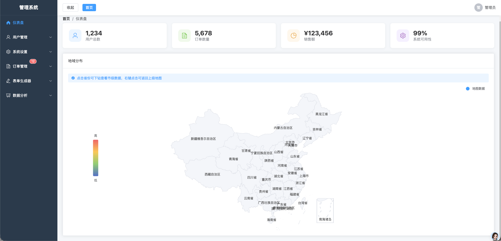
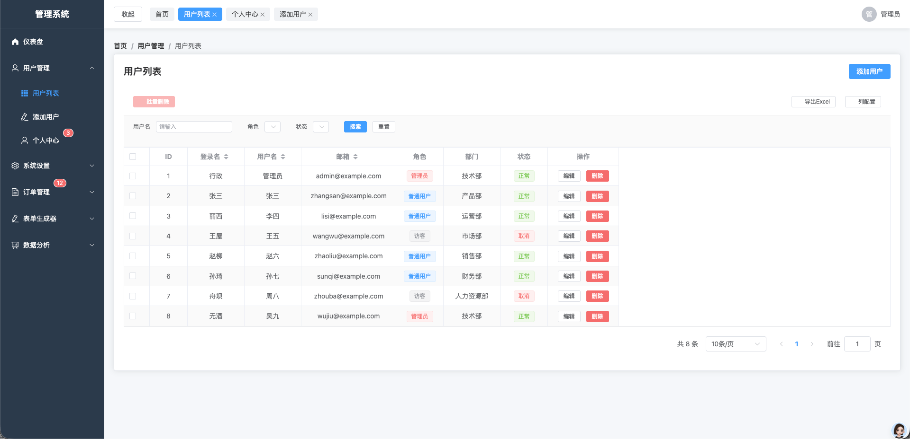
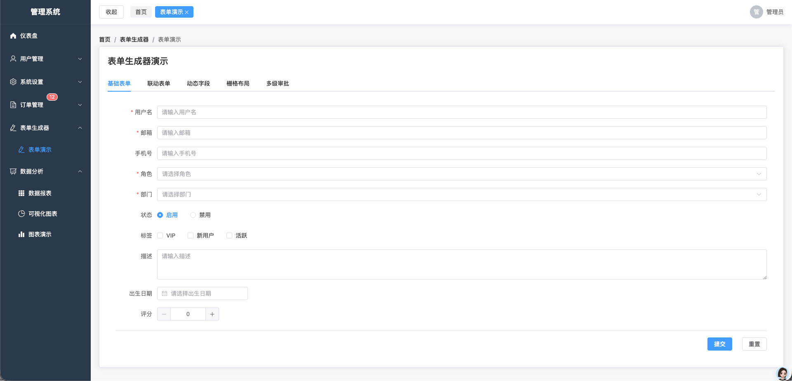
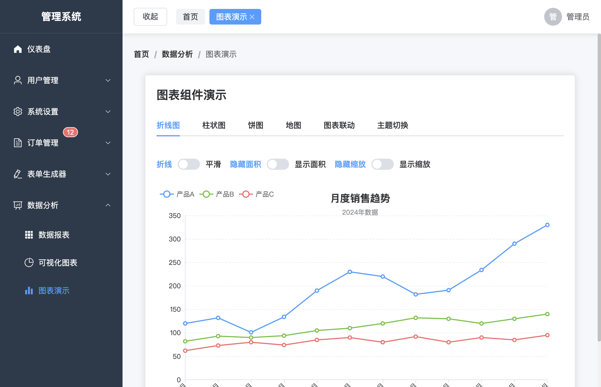
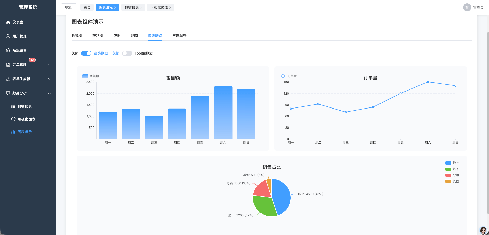

<p align="center">
  <h1 align="center">Vue3 Enterprise Admin</h1>
  <p align="center">
    <b>开箱即用的 Vue3 企业级后台管理模板</b>
  </p>
  <p align="center">
    
    
    
    
    
    
  </p>
</p>

## 简介

基于 Vue3 全家桶 + Element Plus 构建的企业级后台管理模板。内置完善的权限系统、高级业务组件和数据可视化方案，帮助开发者快速搭建中后台系统，告别重复造轮子。

**特性一览：**
- 🔐 **企业级权限系统** — RBAC 模型，支持路由权限、按钮权限、数据权限三级控制
- 📋 **高级表格组件** — 分页/排序/筛选/列配置/行内编辑/导出 Excel/树形表格
- 📝 **表单生成器** — JSON Schema 驱动，支持 14 种字段类型、15 种校验、联动逻辑
- 📊 **数据可视化** — ECharts 深度封装，折线/柱状/饼图/地图，支持主题切换和图表联动
- 🗂️ **动态路由与菜单** — 后端配置驱动，支持多级嵌套、面包屑、标签页、缓存控制
- 🌗 **布局与主题** — 响应式侧边栏、暗色主题、标签页导航
- 📦 **开箱即用** — Mock 数据内置，`npm run dev` 即可运行

## 技术栈

| 技术 | 版本 | 说明 |
|------|------|------|
| Vue | 3.5+ | 渐进式 JavaScript 框架 |
| Vite | 8+ | 下一代前端构建工具 |
| Pinia | 4+ | Vue 状态管理 |
| Vue Router | 5+ | 官方路由管理 |
| Element Plus | 2.14+ | Vue 3 组件库 |
| Axios | 1+ | HTTP 客户端 |
| ECharts | 6+ | 数据可视化图表库 |
| XLSX | 0.18+ | Excel 文件导入导出 |
| SCSS | - | CSS 预处理器 |

## 快速开始

### 环境要求

- Node.js >= 18
- npm >= 9

### 安装与运行

```bash
# 克隆项目
git clone https://gitcode.com/shuaiyao218/vue3-enterprise-admin.git
cd vue3-enterprise-admin

# 安装依赖
npm install

# 启动开发服务器（内置 Mock 数据，无需后端）
npm run dev

# 构建生产版本
npm run build
```

启动后访问 `http://localhost:5173`，使用内置测试账号登录：

| 角色 | 账号 | 密码 | 权限 |
|------|------|------|------|
| 管理员 | admin | 123456 | 全部功能 |
| 普通用户 | user | 123456 | 部分功能 |

## 功能模块

### P0 · 基础框架

| 模块 | 功能点 |
|------|--------|
| 登录认证 | Token 管理（localStorage + Cookie）、自动登录、Token 过期自动刷新 |
| 权限系统 | RBAC 多角色控制、路由级权限、按钮级权限（v-permission 指令）、数据权限 |
| 动态路由 | 后端配置驱动菜单、多级嵌套路由、面包屑导航、标签页缓存 |
| API 封装 | Axios 统一拦截、请求去重、错误码处理、多环境配置 |
| 布局系统 | 响应式侧边栏、顶部导航、标签页、面包屑 |

### P1 · 高级组件

| 组件 | 功能点 |
|------|--------|
| 高级表格 | 分页/排序/筛选/列配置/行内编辑/导出 Excel/多选/树形表格 |
| 表单生成器 | JSON Schema 配置、14 种字段类型、15 种校验规则、级联联动、动态增删字段、响应式布局 |
| 数据可视化 | 折线图/柱状图/饼图/地图、主题切换（亮/暗）、图表联动、地图下钻、自适应容器、自动刷新 |

## 项目结构

```
src/
├── api/                  # 接口层
│   ├── index.js          # Axios 实例 & 请求方法
│   ├── interceptors.js   # 请求/响应拦截器
│   ├── mock/             # Mock 数据
│   └── modules/          # 按模块拆分的 API
├── assets/               # 静态资源
├── components/           # 通用组件
│   ├── Table/            # 高级表格组件
│   ├── Form/             # 表单生成器
│   └── Chart/            # 图表组件（折线/柱状/饼图/地图）
├── composables/          # 组合式函数
│   ├── useTable.js       # 表格逻辑复用
│   ├── useForm.js        # 表单逻辑复用
│   ├── usePermission.js  # 权限逻辑
│   ├── useLinkage.js     # 表单联动
│   └── useDynamicFields.js # 动态字段
├── directive/            # 自定义指令
│   ├── permission.js     # v-permission 按钮权限
│   └── debounce.js       # v-debounce 防抖
├── layout/               # 布局组件
│   ├── index.vue         # 主布局
│   ├── Sidebar.vue       # 侧边栏
│   ├── Header.vue        # 顶部导航
│   ├── TagsView.vue      # 标签页
│   ├── Breadcrumb.vue    # 面包屑
│   └── Container.vue     # 子菜单容器
├── router/               # 路由配置
│   ├── index.js          # 路由定义
│   ├── guard.js          # 路由守卫
│   └── componentMap.js   # 动态组件映射
├── store/                # Pinia 状态管理
│   ├── index.js          # Pinia 初始化
│   └── modules/
│       ├── user.js       # 用户状态
│       ├── permission.js # 权限状态
│       └── app.js        # 应用状态
├── styles/               # 全局样式 & 主题变量
├── utils/                # 工具函数
│   ├── auth.js           # Token 存取
│   ├── validate.js       # 校验工具
│   ├── validateRules.js  # 校验规则库
│   ├── format.js         # 格式化工具
│   ├── export.js         # 导出工具
│   └── chart/            # 图表配置工具
└── views/                # 页面
    ├── login/            # 登录页
    ├── dashboard/        # 仪表盘
    ├── user/             # 用户管理
    ├── order/            # 订单管理
    ├── form-demo/        # 表单生成器演示
    ├── chart-demo/       # 图表组件演示
    ├── analytics/        # 数据分析
    ├── settings/         # 系统设置
    └── error/            # 错误页（404）
```

## 截图预览

<p align="center">
  <strong>登录页</strong><br/>
  <br/><br/>
  <strong>仪表盘</strong><br/>
  <br/><br/>
  <strong>用户列表（高级表格）</strong><br/>
  <br/><br/>
  <strong>表单生成器</strong><br/>
  <br/><br/>
  <strong>数据可视化</strong><br/>
  <br/><br/>
  <strong>图表联动</strong><br/>
  
</p>

## 核心用法示例

### 高级表格

```vue
<AdvancedTable
  :api="fetchUserList"
  :columns="columns"
  :exportable="true"
  :editable="true"
  @edit-save="handleEdit"
/>
```

### 表单生成器

```vue
<FormGenerator
  :schema="formSchema"
  @submit="handleSubmit"
/>

<script setup>
const formSchema = {
  fields: [
    { prop: 'name', label: '姓名', type: 'input', rules: [{ type: 'required' }] },
    { prop: 'email', label: '邮箱', type: 'input', rules: [{ type: 'email' }] },
    { prop: 'role', label: '角色', type: 'select', options: [
      { label: '管理员', value: 'admin' },
      { label: '用户', value: 'user' }
    ]}
  ],
  linkage: {
    showHide: [
      { watchField: 'role', targetField: 'dept', condition: 'admin' }
    ]
  }
}
</script>
```

### 图表组件

```vue
<LineChart
  title="月度销售趋势"
  :xAxisData="['1月', '2月', '3月', '4月']"
  :data="[{ name: '产品A', data: [120, 132, 101, 134] }]"
  :smooth="true"
  :showArea="true"
/>

<ChartGroup :syncHighlight="true" :syncTooltip="true">
  <BarChart title="销售额" :data="barData" />
  <LineChart title="订单量" :data="lineData" />
  <PieChart title="占比" :data="pieData" />
</ChartGroup>
```

## 文档

| 文档 | 说明 |
|------|------|
| [接口配置文档](./docs/api-config.md) | Axios 封装、请求拦截、Token 刷新、Mock 配置 |
| [菜单配置文档](./docs/menu-config.md) | 动态路由、菜单配置项、多级嵌套 |
| [权限控制文档](./docs/permission-guide.md) | RBAC 权限模型、路由守卫、按钮权限 |
| [表格组件文档](./docs/table-guide.md) | 高级表格 API、行内编辑、导出功能 |
| [表单生成器文档](./docs/form-schema.md) | JSON Schema 配置、校验规则、联动逻辑 |
| [图表组件文档](./docs/chart-components.md) | 图表 API、主题切换、联动配置 |

## 多环境配置

项目支持多环境，通过 `.env.*` 文件切换：

| 环境 | 命令 | 说明 |
|------|------|------|
| 开发 | `npm run dev` | 默认开启 Mock |
| 测试 | `npm run dev:test` | 连接测试环境 |
| 生产 | `npm run dev:prod` | 连接生产环境 |
| 构建 | `npm run build` | 生产构建 |
| 测试构建 | `npm run build:test` | 测试环境构建 |

## 浏览器支持

- Chrome >= 90
- Firefox >= 88
- Edge >= 90
- Safari >= 14

## 常见问题

<details>
<summary>如何对接真实后端 API？</summary>

1. 将 `.env.development` 中 `VITE_USE_MOCK` 改为 `false`
2. 修改 `VITE_API_BASE_URL` 为实际后端地址
3. 在 `src/api/modules/` 下按模块组织接口
</details>

<details>
<summary>如何添加新页面？</summary>

1. 在 `src/views/` 下创建页面组件
2. 在 `src/router/index.js` 中添加路由配置
3. 配置 `meta` 属性（title、icon、roles、keepAlive 等）
</details>

<details>
<summary>如何自定义表单字段类型？</summary>

在 `src/components/Form/FormField.vue` 中添加新的字段类型分支，并在 `form-schema.md` 文档中补充说明。
</details>

## 贡献

欢迎提交 Issue 和 Pull Request！

## 开源协议

[MIT](LICENSE) © 2026
